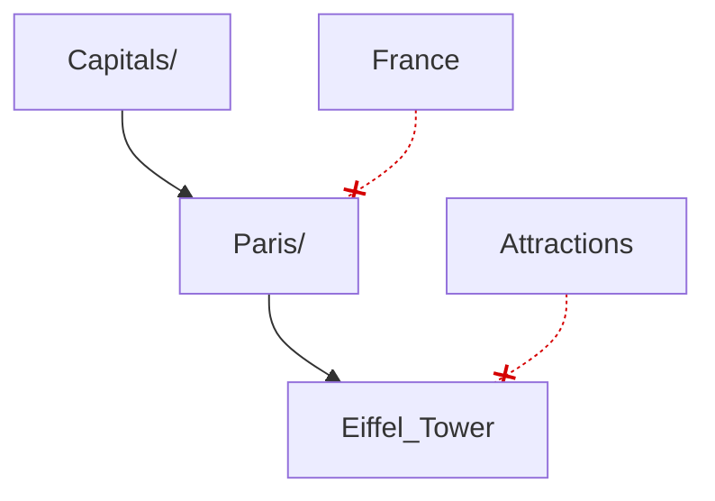
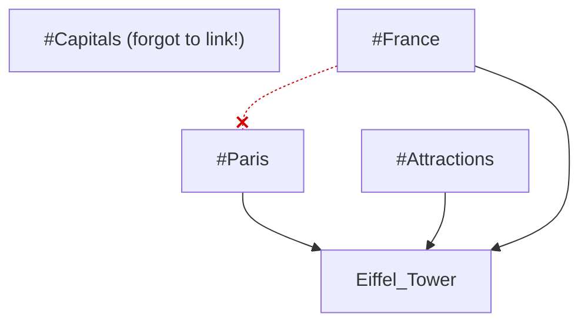
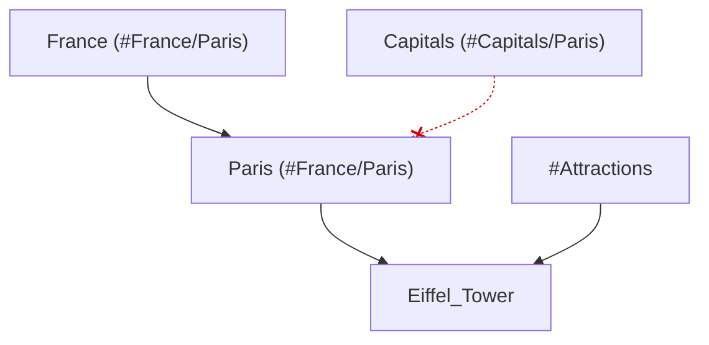
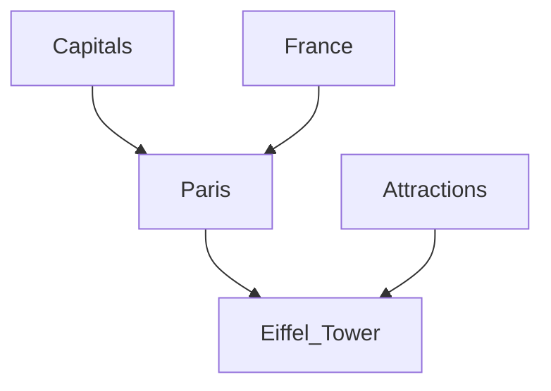

# ~~Lazy~~ Cached Vault Loader

Do you have a big vault (3k+ files)? Have you tried to use mobile Obsidian to open it? Then you know how awfully long the loading takes. At some point, the mobile app simply becomes completely unusable, not just for quick notes. The Obsidian team has claimed that they have fixed that in 1.7, but this is just plain false, as the app is still unbearable for anything larger than a few thousand files.

Now, behold! With this plugin, that experience is a thing of the past! Be ready for under 2-3 seconds (sic!) of loading time for even the largest of vaults (30k and up)!

https://github.com/user-attachments/assets/418e8a3a-1d52-49e6-876f-3134a103355c

## How it works

On the first load, the app loads normally while the plugin populates the cache in IndexedDB. On subsequent loads, this plugin uses the cache to boot all the underlying machinery that Obsidian uses and traverses the file system in the background to reconcile possible changes. Obviously, the plugin also keeps the cache in sync with the file system during the whole session, so the experience should be absolutely the same as without the plugin unless you heavily mess with your vault outside the app between app sessions (in such a case, at each app startup, these changes would be propagated within the ordinary "vanilla" loading time frame).

## Why do you have such a large vault?

I do not agree with the author of Trillium on the storage medium for notes, but I do agree that one's personal storage medium has to be scalable up to one's lifespan. So, with 10+ notes a day for 70 years, that's around hundreds of thousands of notes. And that's not that much! Our computers are insanely fast and are capable of storing thousands of times more than that. It has to be easy-peasy! But unfortunately, more often than not, this is not the case.

I also have to make one remark. To be frank, my 30k vault is only 5% notes, and the rest are files. I consider my personal knowledge base to be a personal data base, so all my photos, bookmarks, archives, books, documents, music, videos, playlists, and everything else that is meaningful and should be persisted is stored there. As a result, all my data is interconnected. I can tag, reference, list, embed, search, and filter all of my data, no matter its file type or origin.

## I would like to follow your suit! Do you have other awesome plugins that would help me do this?

Yeah! I have written a bunch of other plugins with that goal in mind:

- [auto-folder-note-paste](https://github.com/d7sd6u/obsidian-auto-folder-note-paste) - makes sure your attachments are "inside" your note on paste and drag'n'drop by making your note a folder note, so from this:

```
.
└── Note.md
```

To this:

```
.
└── Note
    ├── attachment.png
    └── Note.md
```

- [folders-graph](https://github.com/d7sd6u/obsidian-folders-graph) - adds folders as nodes to graph views
- [reveal-folded](https://github.com/d7sd6u/obsidian-reveal-folded) - reveals current file in file explorer while collapsing everything else
- [hide-index-files](https://github.com/d7sd6u/obsidian-hide-index-files) - hides folder notes (index files) from file explorer. Use with [folder-notes](https://github.com/LostPaul/obsidian-folder-notes) (it has the same feature, but that feature is poorly implemented and I am too lazy to submit a patch to this wonderful plugin) so that your tree looks like this:

```
.
└── Note
    └── attachment.png
```

And not like this:

```
.
└── Note
    ├── attachment.png
    └── Note.md
```

- [crosslink-advanced](https://github.com/d7sd6u/obsidian-crosslink-advanced) - adds commands to deal with ftags-oriented vaults: add ftags, create child note, open random unftagged file, etc.
- [virtual-dirs](https://github.com/d7sd6u/obsidian-virtual-dirs) - adds "virtual" folder files / folder indexes. You can open them, you can search for them, but they do not take space and "materialize" whenever you want a _real_ folder note
- [viewer-ftags](https://github.com/d7sd6u/obsidian-viewer-ftags) - adds ftags as chips on top of markdown/file editors/previews. And children as differently styled chips too!
- [git-annex-autofetch](https://github.com/d7sd6u/obsidian-git-annex-autofetch) - lets you open annexed but not present files as if they were right on your device (basically, NFS/overlay-fs hybrid in your Obsidian)

First, folder/index notes. Basically, that's just a way to remove the distinction between a folder and a note, just like in Notion or Trillium. There is no reason why you should not be able to use a folder as a note, as it is often the case that there is some data that relates to every child in a folder. Maybe that's a description of a series of lectures or a commentary on a book (which is basically a folder for pages). Even attachments benefit immensely from removing this distinction, as rather than cramming every attachment from every note in your vault into a single auxiliary directory (where they are disconnected from their related notes and are completely unrelated to each other) or making them a sibling file (which is very easy to lose while moving notes and pollutes the note's parent folder), all attachments are just children of their respective notes.

As Obsidian stores notes as plain files, this pattern is usually implemented as folder/index notes. For example, like this:

```
.
└── Note
    ├── attachment.png
    └── Note.md # I prefer (and support) this one! Although ugly, it has the best compatibility during search and moving with external tools
```

This:

```
.
└── Note
    ├── attachment.png
    └── index.md # I wish it was supported everywhere. It is robust to "name-drift" during renaming and is arguably best-looking, but search in text editors usually sucks with these
```

Or this:

```
.
├── Note
│ └── attachment.png
└── Note.md
```

Second, ftags. Basically, an ftag is a hybrid of a tag and a folder. You may call it a hierarchical tag (a tag that can have tags) or a taggable folder (a folder with more than one parent folder). In Trillium, that concept is called "Cloning"; in Linux, symlinks essentially are ftags in disguise.

Why are they useful? It is easier to understand by following an example:
You store one note per concept. You have "Paris," "Eiffel Tower," "Attractions," "France," and "Capitals." With folders, you can start sorting everything like this: Capitals -> Paris -> Eiffel Tower. So far, so good. But why not Attractions -> Eiffel Tower? Why not France -> Paris -> Eiffel Tower? Because you cannot have a file in two folders at once, so you have to choose either one or another. This is not good; your only choice is to lose valuable information (that the Eiffel Tower is an attraction). Other "solutions" include duplicating folders (creating an Attractions folder for each city), which makes searching harder and essentially loses information, just in a more peculiar way.



Now let's try using tags. We could go like this: #Attractions, #Paris, #France -> Eiffel Tower. Have you spotted the problem? Now we have redundancy! This is also bad, as it is obvious that something in #Paris is also in #France, and we have to either add both by hand (and risk hesitation and/or human error) or lose information.



And no, nested tags are just duplicated tags in disguise. And see what problem we would have with them: #France/Paris -> Eiffel Tower or #Capitals/Paris -> Eiffel Tower? If only we could give #Paris several tags...



That's where ftags save the day! Now you can have an arbitrary DAG as your tag system. #Attractions, #Paris -> Eiffel Tower; #France, #Capitals -> #Paris



I model them with ordinary folders (supercharged with folder notes) and `.symlinks` frontmatter property that is filled with wikilinks to all child notes/files. This also means that every note is a tag and every tag is a note.
Previously, I modeled it with symlinks (which is neat and tidy), but, though a part of the POSIX standard, a lot of software behaves poorly with symlinks. And it is totally not transportable to other OSes, even Android.

Third, "annexed." You really should read about [git-annex](https://git-annex.branchable.com/), but TL;DR: store metadata about your files in Git, while their content may be stored and managed separately. It is like `git-lfs` but much, much more powerful and allows you to store large files only on selected devices/remotes rather than forcing you to store everything everywhere! So, for example, you can be sure you have at least two copies of the contents of each file, at least one copy on an offsite cold backup disk, and only _.mp3 files should be stored on your mobile phone. This way, you have at least two backups of every file, an offsite cold backup of every file, and your phone's storage is not overwhelmed with your _.raw image files collection.

## Disclaimer / Safety

This plugin does not call any of the destructive file system APIs (write, move, delete), but as it patches very delicate, undocumented internal modules of Obsidian, beware that "Here be dragons." Always [backup](https://en.wikipedia.org/wiki/Backup#:~:text=3-2-1%20rule) your vault, whether you use this plugin or not.

This plugin should not interfere with other plugins and should work transparently for both the user and other plugins, but as any plugin may monkey-patch anything anywhere arbitrarily, something may break somewhere. Keep that in mind and see the previous paragraph.

## Settings

There is a button to clear the cache on the plugin's settings page. In the unlikely event of cache corruption, you can tap it and restart the app to repopulate the cache from scratch.

## Future features / TODO

There should be a setting to turn on progressive loading during the app startup. Initially, this plugin was intended to be used without a cache, and the user could view how new files were added to the app's interface. As loading the cache is CPU-bound, progressive loading does not make sense at that stage, but during the initial population of the cache, that might help eliminate annoying wait times.

Speaking of progressive vault loading, there should be an option to turn the cache off. Perhaps having non-existent files in search and file explorer for 10 to 20 seconds is annoying for someone. This is low-hanging fruit, though, so there is no reason not to implement that.

There is a word "lazy" in the title for a reason. While there is no "laziness" in the vault loading right now, except for the deferral of vault traversing, in the future, opening (or even seeing) folders and vaults should trigger the loading/reconciliation of these paths. That would increase the reliability of the search and even open the possibility of full laziness—only loading opened paths and deferring everything else, with external tools updating search/backlinks/Dataview® cache.

## Contributing

Issues and patches are welcome. This plugin is intended to be used with other plugins, and I will try to do my best to support this use case, but I retain the right to refuse to support any given plugin for arbitrary reasons.

## Support

Thanks to the lack of available source code writing ambitious low-level reengineering plugins for Obsidian is hard and time-consuming. If you enjoy this plugin, you can [buy me a coffee](https://ko-fi.com/d7sd6u) (or better a coffee-subscription) and ensure that I can continue writing and supporting my (and others') plugins.
